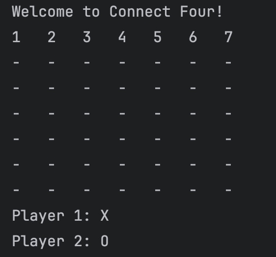
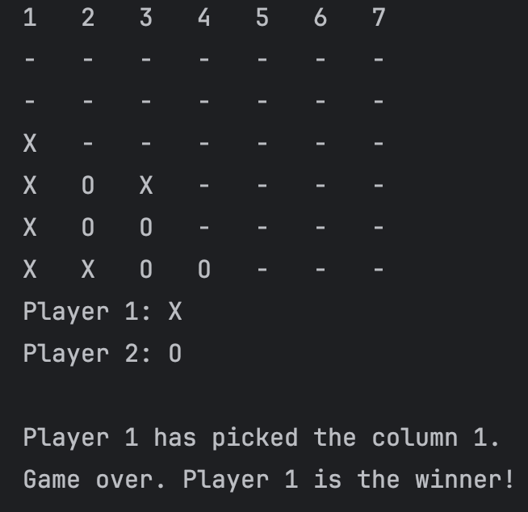
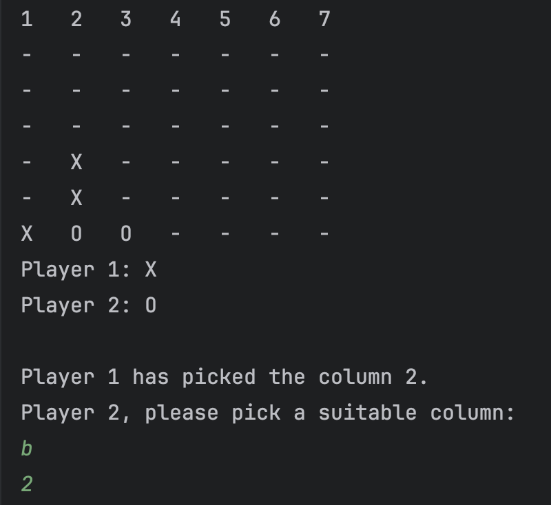
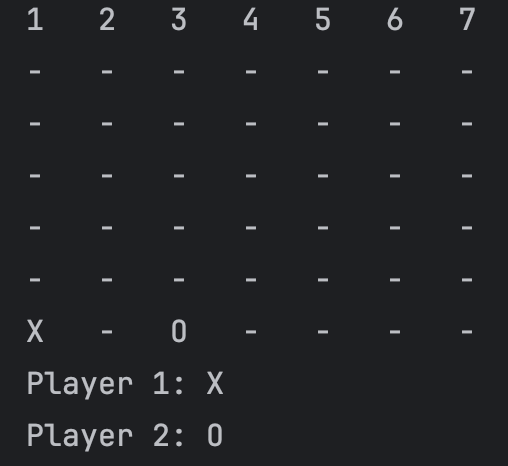
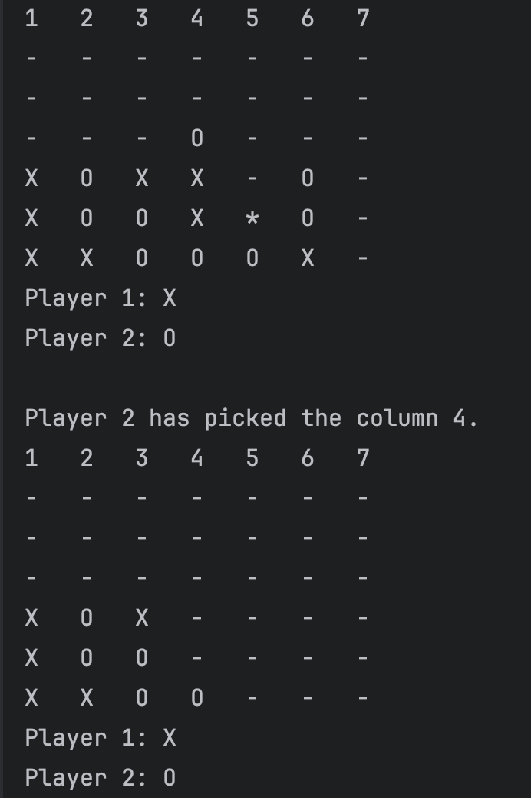

## Description 

"Connect Four" is a command-line Java application. It is built in using Maven for dependency management and project structure. 


## Table of Contents

- [Prerequisites](#prerequisites)
- [How to Set Up and Run](#how-to-set-up-and-run)
  - [Cloning the Repository](#cloning-the-repository)
  - [Building the Project](#building-the-project)
  - [Running the Application](#running-the-application)
- [Testing](#testing)
- [Instructions](#instuctions)


## Prerequisites 

Please ensure you have the following installed to setup and run the application

- Java 21+
- Mavan 3.9.9+

## How to set up and run

### Cloning the repository 

To clone the repository, use the following command: 

 ```bash
  git clone https://github.com/pockche123/ConnectFour.git
  cd <ConnectFourDirectory>
  ```

### Building the project 

To buid the project using maven, use the following command: 

 ```bash
  mvn clean install 
  ```

### Running the application 

To run the game after it has been successfully built, use the following command: 

 ```bash
  java -jar target/ConnectFour-1.0-SNAPSHOT.jar
  ```

## Testing 

To run the unit tests, use the following command: 

 ```bash
  mvn test
  ```

## Instructions 

The objective of the game is to connect four discs (either X or O) in a row (horizontally, vertically, or diagonally). The player starts the game by selecting a column and pressing "Enter", which drops the disc to the lowest available row in that column.



However, there are additional features. 

### Additional features 

The game includes two additional features: a clear-column bomb and a time bomb.

Clear-Column Bomb

A clear-column bomb clears an entire column. To place a clear-column bomb:

1. Press "b" and hit "Enter".
2. Select the column you want to clear and hit "Enter".
 
| Before Bomb | After Bomb |
|-------------|------------|
|  |  |


To cancel a bomb selection  after you have pressed a "b", you have to press "Enter" twice. 

A time bomb clears the cell where it is placed and all its neighboring cells (horizontally, vertically, or diagonally) after the opponent has made two moves. When the bomb clears, any discs above the cleared cells will fall down. If this results in a connect-four, it will declare a winner.



To place a time bomb:

1. Press "*" and hit "Enter".
2. Select the column where you want to place the bomb.

To cancel a bomb selection after pressing "*", press "Enter" twice.

Note: Only one bomb (either a clear-column bomb or a time bomb) can be placed at a time.


 

